<!-- ==================== HEADER ==================== -->

  

<!-- ==================== TYPING SVG ==================== -->

  

<!-- ==================== METRICS BADGES ==================== -->

  
  
  

<!-- ==================== HERO BANNER ==================== -->

  

<!-- ==================== DIVIDER ==================== -->

  

## 👋 自己紹介

- 🎓 工学部 電気電子工学科 在学中
- 🚀 自作Chrome拡張 **KULMS+** が **2932人以上** に利用されています
- 🎮 ゲーム開発・AIに強い関心あり
- 🏢 ゲーム会社・スタートアップでの開発インターン経験あり

<!-- ==================== DIVIDER ==================== -->

  

## 📱 個人プロジェクト

> [!NOTE]
> **KULMS+** は35+ リリースを重ね、2,932人以上のアクティブユーザーを持つChrome拡張機能です。

<table>
  <thead>
    <tr>
      <th></th>
      <th>プロジェクト</th>
      <th>概要</th>
      <th>主な技術</th>
      <th>リンク</th>
    </tr>
  </thead>
  <tbody>
    <tr>
      <td>🧩</td>
      <td><b>KULMS+</b></td>
      <td>大学LMSのChrome拡張機能 · <b>2932+ users</b></td>
      <td>
        
        
        
      </td>
      <td>
        <a href="https://github.com/Radian0523/kulms-extension">GitHub</a> ·
        <a href="https://chromewebstore.google.com/detail/kulms+/akfadmompgbhncnocomalofhcihpejjb">Store</a>
      </td>
    </tr>
    <tr>
      <td>📱</td>
      <td><b>KULMS+ Mobile</b></td>
      <td>KULMS+のAndroid / iOSアプリ · <b>ローンチ初日 500+ users</b></td>
      <td>
        
        
        
        
      </td>
      <td>
        <a href="https://github.com/Radian0523/kulms-android-webview">Android</a> ·
        <a href="https://github.com/Radian0523/kulms-ios-webview">iOS</a>
      </td>
    </tr>
    <tr>
      <td>🎮</td>
      <td><b>Velora</b></td>
      <td>
        3D FPS シューティングゲーム
        
      </td>
      <td>
        
        
      </td>
      <td>
        <a href="https://github.com/Radian0523/Velora">GitHub</a>
      </td>
    </tr>
  </tbody>
</table>

<!-- ==================== DIVIDER ==================== -->

  

## 👥 チームプロジェクト

| プロジェクト | チーム規模 | 概要 | 技術 |
|---|---|---|---|
| BitSummit Game Jam 2026 | 9人 | 謎解き2Dゲーム（[BitSummit](https://bitsummit.org/) 出展） | Unity, C# |
| みんなでゲームを作る2025 | 6人 | Joyconをオールに見立てた3Dボートゲーム（学園祭展示） | Unity, C# |
| p-malware | 5人 | メタ的な敵が登場する3Dシューティング | Unity, C# |
| NoOneKnowsME | 10人 | 2Dホラーゲーム | Unity |
| p-victory | 8人 | ゲームプロジェクト | Unity |

<!-- ==================== DIVIDER ==================== -->

  

## 💼 インターン経歴

| 期間 | 企業 | 担当内容 | 主要技術 |
|---|---|---|---|
| 2026/01 –  | ゲーム会社 | 社内アセット管理ツール設計・開発（イベント駆動アーキテクチャ、LocalStack環境構築） | TypeScript, Python, AWS |
| 2025/12 –  | ITスタートアップ | 5種のプロジェクト（ダッシュボード・バックエンド・テスト設計・AI調査） | TypeScript, Next.js, PHP/Laravel |
| 2024/10 – 2025/11 | エンタメ系企業 | ゲーム開発、BLE通信、LINE Bot、Webアプリ | C, C#, Unity, Kotlin, Python |

> [!TIP]
> インターン中、公式ドキュメントが存在しないGeneralplusライブラリをC言語で習得し、商用ゲームを期限内に納品しました。

<!-- ==================== DIVIDER ==================== -->

  

## 🛠️ スキルセット

業務経験・個人開発での実使用経験を基準に掲載しています。

**💻 言語**

  
  
  
  
  
  
  
  
  
  
  

**🎮 ゲーム開発**

  
  

**📱 モバイル**

  
  
  

**🌐 Web フロントエンド**

  
  
  
  
  
  
  

**🖥️ Web バックエンド**

  
  

**☁️ インフラ / クラウド**

  
  
  
  
  
  
  
  
  
  
  
  
  

**🗄️ データベース**

  
  
  

**🔧 ツール**

  
  
  
  
  

<!-- ==================== DIVIDER ==================== -->

  

## 📊 GitHub Stats

  
  

  

  

<!-- ==================== FOOTER ==================== -->

  

